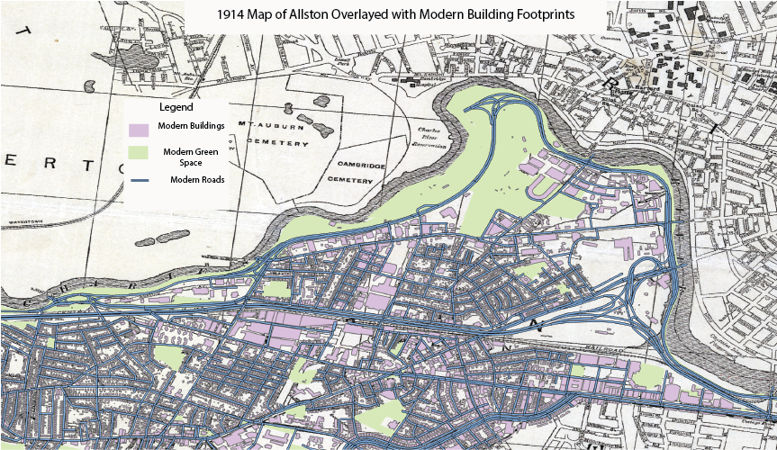
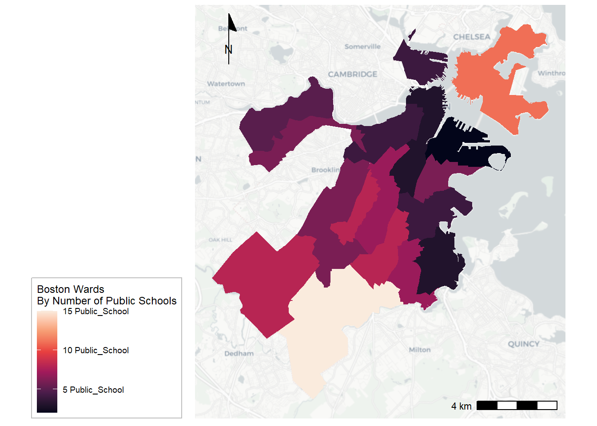
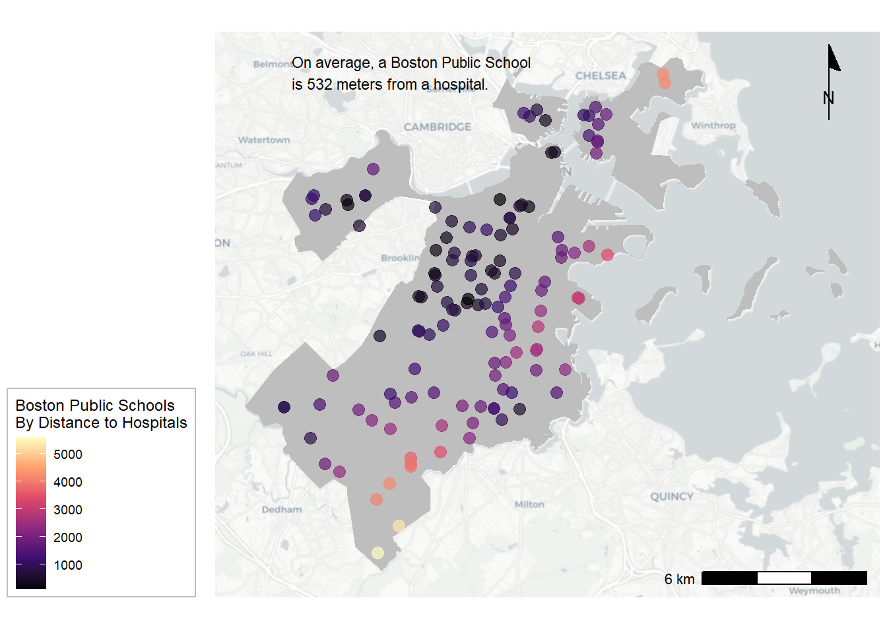
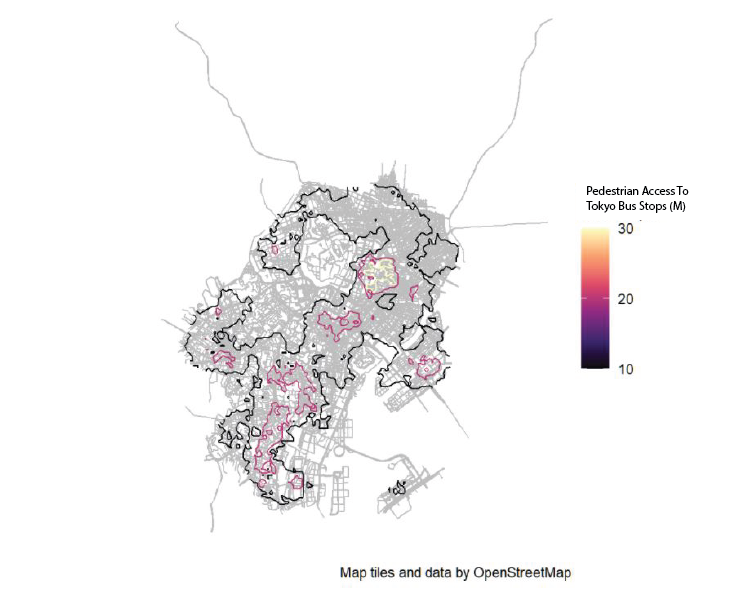

```{r setup, include=FALSE}
knitr::opts_chunk$set(echo = TRUE)
```

# Introduction

This portfolio displays the skills that I learned in Spatial Analysis VIS 2128 in various geographic regions. Most of the maps were made collaboratively with my various team members. 


# Interactive Map
This map displays internet access in Los Angeles census tracts and demonstrates my ability to create an interactive map.

[](https://gracelevin.github.io/Graceportfolio//fullsize/nointernet.html){target="_blank"}

# Historic Map
This is a 20th century historic map of Allston that I georeferenced and overlayed with current day buildings, roads, and green space. This demonstrates my ability to display multiple vectors and georeference and display a raster image.

This map was created collaboratively with Joaquin and Femi.


[](https://gracelevin.github.io/Graceportfolio/fullsize/historicmap.png){target="_blank"}

# Boston Maps
Here are two maps of Boston, where we were looking at the relationship between public schools and hospitals. These maps were created in collaboration with Laureen and Shrinkhala.

## Boston Public Schools
This map demonstrates my ability to aggregate point data to a layer of polygons.  

[](https://gracelevin.github.io/Graceportfolio/fullsize/publicschools.png){target="_blank"}

## Distance From Schools To Hospitals
This map demonstrates my ability to display relationships among point and polygon layers based on distance.

[](https://gracelevin.github.io/Graceportfolio/fullsize/hospital.png){target="_blank"}


# Pedestrian Bus Access
This map demonstrates access for pedestrians to Tokyo bus stops based on travel time. It demonstrates my ability to convert between raster and vector layers and calculate accessibility based on travel time.

The map was created in collaboration with Francisco and Yoji.


[](https://gracelevin.github.io/Graceportfolio//fullsize/tokyobus.png){target="_blank"}

